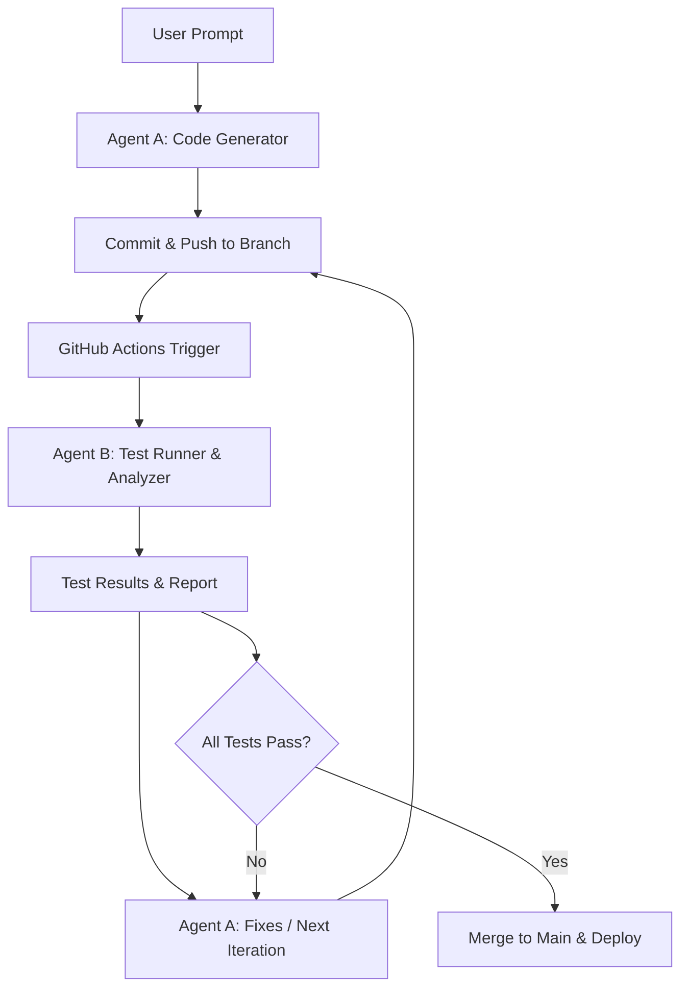

# Where this repo is now

1. working: successfully reviews pull requests and adds in-line comments
2. next: replicate the action into several actions and change the prompt here:
https://github.com/villesau/ai-codereviewer/blob/main/dist/index.js#L108-L115
3. why: you can create actions that review it for different purposes: style guide, readability, cognitive load gauge


# The Idea: Autonomous Dev Team

This method embodies a new wave of “AI-native” development pipelines where models generate, test, and refine code autonomously.

With a bit of glue code (Python scripts, GitHub Actions), two GPT agents can autonomously iterate on code + tests until your vertical‑farm web app is working. This pattern can be generalized to almost any software project—once your CI is your playground.


## Overall Flow



1. User Prompt

“Please develop a production‑level web application with an API that controls and visualizes a vertical farming environment.”

2. Agent A: Code Generator

Reads the user prompt and existing codebase (or empty repo).

Produces new or updated code files (e.g. Django/DRF backend, React frontend, Dockerfiles, workflows).

3. CI Trigger

Pushes Agent A’s changes to a feature branch (e.g. ai/iteration-1).

Triggers GitHub Actions workflow.

4. Agent B: Test Runner & Analyzer

Executes tests (unit, integration, lint, security scans).

Parses test results and error logs.

Writes back a structured “test report” (e.g. JSON with failures).

5. Agent A (Next Iteration)

Reads the test report.

Fixes failures or adds missing functionality.

Commits to the branch.

6. Loop

Repeat CI runs until all tests pass or a stopping criterion is met (e.g. max iterations, no diff).

7. Merge & Deploy

Once green, automatically merge into main and trigger deployment.

## Key Components

Component	Role
GitHub Repo	Source of truth for code; houses workflows and branch policies.
GitHub Actions	Orchestrates the loop: runs tests, invokes agents, merges green.
Agent A (GPT)	“Writes” code based on prompt + feedback.
Agent B (GPT)	“Reads” test outputs, diagnoses issues, writes feedback.
State Store	Keeps iteration count, last test results, conversation history.
Branch Management	Each iteration lives in its own branch or PR.
Stopping Logic	CI job checks for “all tests passed” or “max iterations hit.”

## Example GitHub Actions Workflow

```yaml

name: AI-Driven Iteration

on:
  push:
    branches:
      - 'ai/iteration-*'

jobs:
  test-and-feedback:
    runs-on: ubuntu-latest
    steps:
      - uses: actions/checkout@v3

      - name: Run Tests
        id: run_tests
        run: |
          pytest --junitxml=results.xml || true

      - name: Upload Test Results
        uses: actions/upload-artifact@v3
        with:
          name: test-results
          path: results.xml

      - name: Analyze & Request Fix
        id: ai_feedback
        run: |
          python .github/scripts/agent_b.py \
            --results-path results.xml \
            --history-path .ai/history.json \
            --output-patch patch.diff

      - name: Commit Fixes
        if: steps.ai_feedback.outputs.patch != ''
        run: |
          git config user.name "AI Bot"
          git config user.email "ai@bots.local"
          git apply patch.diff
          git commit -am "AI iteration fix"
          git push origin HEAD:$(echo $GITHUB_REF | sed 's/refs\/heads\///')
```

1. .github/scripts/agent_b.py would:

Load the test results.

Construct a prompt for GPT‑4 like:

“Here are the test failures. Please modify the code in this repo to fix them. Reply with a unified diff.”

Call the OpenAI API.

Write the returned diff to patch.diff.

Agent A is essentially the initial PR or can be similarly scripted in a separate workflow or via a GitHub App that, on issue creation (with the user prompt), populates the repo and opens the first ai/iteration-1 branch.

## State & Conversation Management

To avoid “context drift” and to give the agents memory of past iterations, maintain a simple JSON file (e.g. .ai/history.json) that logs:

```json
[
  { "iteration": 1, "user_prompt": "...", "ai_response": "...", "test_summary": "3 failures" },
  { "iteration": 2, "ai_response": "...", "test_summary": "1 failure" },
  ...
]
```

Each time Agent B runs, it appends its analysis; Agent A reads the full history when generating new code.

## Considerations & Tips

1. Rate Limits & Costs: Each iteration consumes API calls—budget accordingly.
2. Security: Never expose secrets in prompts. Use GitHub Secrets for tokens.
3. Stopping Criteria: Hard‑cap at, say, 10 iterations or until tests pass.
4. Human-in-the-Loop: You may want a manual approval step before merging to main.
5. Test Coverage: Ensure your test suite is comprehensive; otherwise the loop can “green‑wash” missing features.